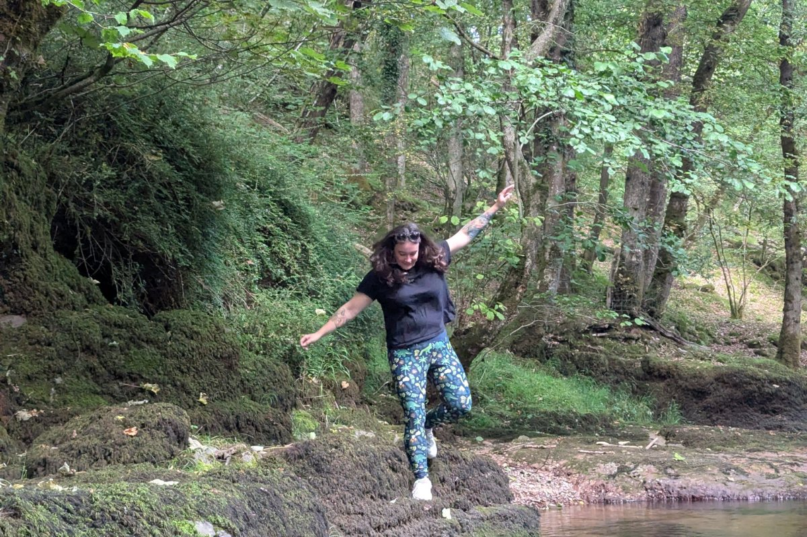
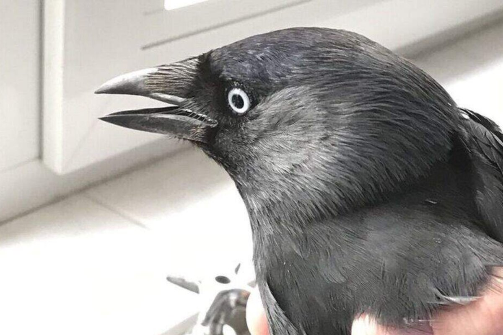
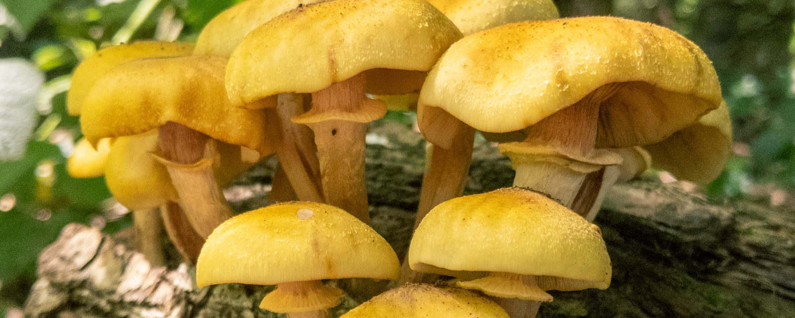
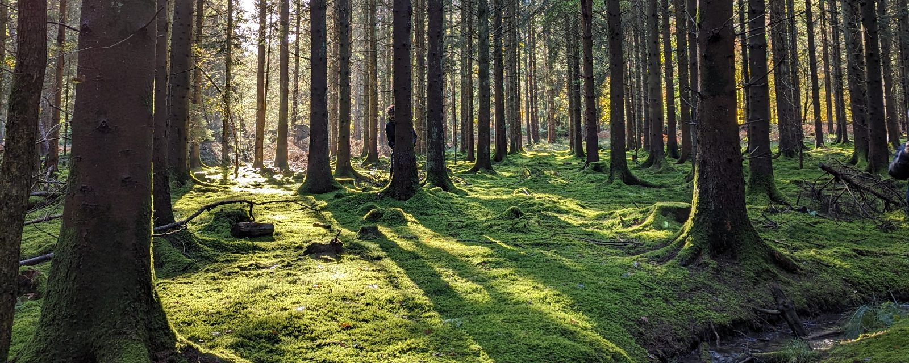

<h1 align="center">chelsea hopkins</h1>

A SKETCHBOOK · DOODLE Nº OOKPASSANT · ALSO ANSWERS TO SEA

comms lead by day. i build the tools i wish existed by night.

  <a href="https://chelseahopkins.co.uk">chelseahopkins.co.uk</a> ·
  <a href="https://hopkinsaction.com">hopkins action</a> ·
  <a href="https://linkedin.com/in/chelsea-hopkins-50822811a">linkedin</a> ·
  <a href="https://whimsee.co.uk">whimsee</a> ·
  <a href="https://heyjackdaw.com">jackdaw</a>

 

## i · the big ones

<table>
  <tr>
    <td width="50%" valign="top">
      
      
doodle i · me, being the user.

      <h3><a href="https://whimsee.co.uk">whimsee</a> live on ios + android</h3>
      
<b>why.</b> i wanted an app that sends you outside instead of keeping you in. you hide a small note where you stand. only someone who walks there can read it. no feed, no algorithms, no infinite anything.

      
<b>the clever bit.</b> postgis decides whether you're actually there. row level security keeps every note dark until you are. edge functions do the rest.

      
<b>built with.</b> expo / react native · next.js on cloudflare workers · supabase · posthog

      
<b>where it lives.</b> wherever you happen to be standing.

      
<b>also writes.</b> the <a href="https://whimsee.co.uk/blog">whimsee blog</a>, research notes on the places themselves, written before anything gets planted in them.

    </td>
    <td width="50%" valign="top">
      
      
doodle ii · a jackdaw, from a reference photo by emma lambert.

      <h3><a href="https://heyjackdaw.com">jackdaw</a> closed beta</h3>
      
<b>why.</b> nobody's coming to run your socials. jackdaw drafts posts in your voice, you veto every one, and it learns what lands.

      
<b>the clever bit.</b> one typescript core under both faces. claude writes per-platform captions, headless chromium renders the carousels, and publishing is idempotent across ten platforms, so a retry never double-posts.

      
<b>built with.</b> typescript / node · telegram bot + web app · claude api · headless chromium · posthog

      
<b>where it lives.</b> telegram, and a web app for bigger screens. the early queue is open.

    </td>
  </tr>
</table>

 

## ii · odds and ends

doodle iii · things found out in the open.

things i've left out in the open.

| thing | what it is |
|---|---|
| [**pressed-hog**](https://github.com/ookpassant/pressed-hog) | a hedgehog with a wordpress plugin in it. wires posthog into wordpress properly: session replay, surveys, woocommerce events, consent modes, a reverse proxy that ad blockers don't clock, and analytics inside wp-admin. |
| [**courser-calculator**](https://github.com/ookpassant/courser-calculator) | horse genetics for a horse rpg i play. rolls four foals from two parents, then lists every foal the pairing could ever produce. runs entirely in your browser. [have a go](https://ook.monster/courser-calc). |
| [**marshpoint**](https://github.com/ookpassant/marshpoint) | marshal signups for motorsport events, self-hosted. invite links, licence uploads, team rosters, and a dashboard for whoever's holding the clipboard. |
| [**minimum-viable-exercise**](https://github.com/ookpassant/minimum-viable-exercise) | a claude code skill. while claude works, it sets me a quick desk workout and checks afterwards whether i did it. |

&nbsp;smaller scraps, some of them rough

 

| thing | what it is |
|---|---|
| [**where-when**](https://github.com/ookpassant/where-when) | i had to be in the office 50% of the time. this kept score. |
| [**speed-countdown**](https://github.com/ookpassant/speed-countdown) | an offline pwa so my dad can count down to his racecar arriving. strongly vibe-coded. |
| [**dirt-plugin**](https://github.com/ookpassant/dirt-plugin) | wordpress admin for off-road racing. |
| [**dirtbike-quiz**](https://github.com/ookpassant/dirtbike-quiz) | which dirtbike are you. |

 

## iii · scribblings

things i've built, written up properly. [all of them](https://chelseahopkins.co.uk/notes/), or the most recent:

<!-- notes:start -->
- [Merge everything. Ship nothing.](https://chelseahopkins.co.uk/notes/merge-everything-ship-nothing/) — How one person runs a release process with 62 feature flags.
- [Your agent has stopped imagining a reader](https://chelseahopkins.co.uk/notes/your-agent-has-stopped-imagining-a-reader/) — you're absolutely right! this article stinks.
- [I picked 10 metres because of a puddle](https://chelseahopkins.co.uk/notes/ten-metres-because-of-a-puddle/) — Never show a button the server will refuse.
- [Taste is the part you can't vibe](https://chelseahopkins.co.uk/notes/taste-is-the-part-you-cant-vibe/) — What an illustration degree taught me about building with an agent.
- [I don't feel at all](https://chelseahopkins.co.uk/notes/i-dont-feel-at-all/) — Eurobeat fancams of Michèle Mouton, and the switch that flips on a start line.
<!-- notes:end -->

 

## iv · commissions

wordpress and woocommerce that real businesses run on. a bookings and membership platform i built is live on three client sites. club management. stock control. a dealer map. all private, all in production.

 

## v · the pencil case

 

## vi · how i work

doodle iv · pine wood, november.

- i ship small and often.
- posthog on everything from day one.
- claude in the loop, me on the veto.
- i write the docs first.
- nocturnal, mostly.
